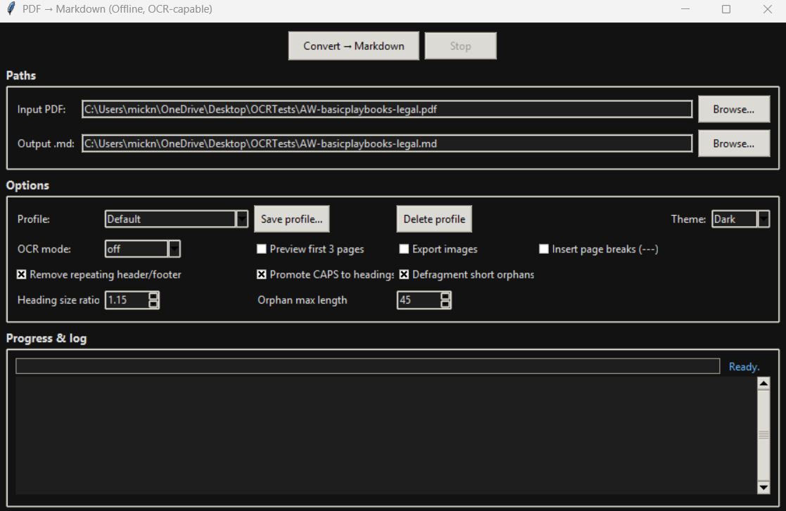

# PDF to Markdown Converter (pdfmd)

**A refined, privacy-first desktop and CLI tool that converts PDFs—including scanned documents—into clean, structured Markdown. Built for researchers, professionals, and creators who demand accuracy, speed, and absolute data privacy.**

**Fast. Local. Intelligent. Fully offline.**


---

## 📑 Table of Contents

- [Privacy & Security First](#️-privacy--security-first)
  - [Trusted for Sensitive Workflows](#trusted-for-sensitive-workflows)
  - [Password-Protected PDFs](#password-protected-pdfs--secure-support)
- [Key Features](#-key-features)
  - [Accurate Markdown From Any PDF](#-accurate-markdown-from-any-pdf)
  - [Automatic Table Detection](#-automatic-table-detection--reconstruction)
  - [Math-Aware Extraction](#-math-aware-extraction--latex-preservation)
  - [Scanned PDF Support (OCR)](#-scanned-pdf-support-ocr)
  - [Modern GUI Experience](#-modern-gui-experience)
- [Interface Preview](#️-interface-preview)
- [Architecture Overview](#-architecture-overview)
  - [Module Overview](#-module-overview)
  - [Design Philosophy](#️-design-philosophy)
  - [Data Flow](#-data-flow-overview)
  - [Why This Matters](#-why-this-matters)
  - [Ready for Future Expansion](#-ready-for-future-expansion)
- [Installation](#️-installation)
  - [Quick Install (Development)](#quick-install-development)
  - [Install as Package](#install-as-package-recommended)
  - [Platform-Specific Setup](#platform-specific-setup)
  - [Windows Standalone Executable](#windows-standalone-executable)
- [Usage](#-usage)
  - [GUI Application](#️-gui-application)
    - [Launching the GUI](#launching-the-gui)
    - [Quick Workflow](#quick-workflow)
    - [Profiles](#profiles)
    - [Keyboard Shortcuts](#keyboard-shortcuts)
    - [GUI Features](#gui-features)
    - [Common GUI Workflows](#common-gui-workflows)
  - [Command-Line Interface](#-command-line-interface)
    - [Installation & Running](#installation--running)
    - [Quick Start](#quick-start)
    - [Common CLI Workflows](#common-cli-workflows)
    - [Full Options Reference](#full-options-reference)
    - [Advanced CLI Examples](#advanced-cli-examples)
    - [Output Behavior](#output-behavior)
    - [CLI Error Handling](#cli-error-handling)
    - [CLI Security Notes](#cli-security-notes)
    - [CLI Performance Tips](#cli-performance-tips)
    - [Exit Codes](#exit-codes)
- [Configuration Options](#-configuration-options)
  - [Key Settings](#key-settings)
  - [Profile Storage](#profile-storage)
- [Example Output](#️-example-output)
  - [Table Example](#table-example)
  - [Math Example](#math-example)
- [Performance Tips](#-performance-tips)
  - [For Large Documents](#for-large-documents-100-pages)
  - [For Slow Systems](#for-slow-systems)
  - [Batch Processing Performance](#batch-processing-performance)
  - [OCR Strategy](#ocr-strategy)
- [Troubleshooting](#️-troubleshooting)
  - [Common Issues](#common-issues)
  - [GUI-Specific Issues](#gui-specific-issues)
  - [Performance Issues](#performance-issues)
- [Contributing](#-contributing)
- [License](#-license)
- [Acknowledgments](#-acknowledgments)
  - [Special Thanks](#special-thanks)
- [Links](#-links)
- [Tips & Best Practices](#-tips--best-practices)
  - [For Researchers](#for-researchers)
  - [For Legal Professionals](#for-legal-professionals)
  - [For Developers](#for-developers)
  - [For General Users](#for-general-users)

---

## 🛡️ Privacy & Security First

Many PDF converters silently upload documents to remote servers. **This tool does not.**

* **No uploads:** Your files never leave your machine
* **No telemetry:** No usage tracking or analytics
* **No cloud processing:** All computation happens locally
* **No background requests:** Completely offline operation

Every step—extraction, OCR, reconstruction, and rendering—happens **locally on your machine**.

### Trusted for Sensitive Workflows

Intentionally designed for environments where confidentiality is non-negotiable:

* 🏥 **Medical:** Clinical notes, diagnostic reports, patient records
* ⚖️ **Legal:** Case files, evidence bundles, attorney-client communications
* 🏛️ **Government:** Policy drafts, restricted documents, classified materials
* 🎓 **Academic Research:** Paywalled journals, unpublished materials, grant proposals
* 💼 **Corporate:** Financial reports, IP-sensitive designs, strategic plans

### Password-Protected PDFs — Secure Support

Full support for encrypted PDFs with security-first design:

✅ **Passwords never logged or saved** — Memory-only processing  
✅ **No command-line exposure** — Prevents process monitoring attacks  
✅ **Auto-cleanup** — Temporary files deleted immediately  
✅ **Interactive prompts** — Hidden input in GUI and CLI  

**GUI:** Modal password dialog with masked input (`*****`)  
**CLI:** `getpass` hidden terminal input

Supports all PDF encryption standards: 40-bit RC4, 128-bit RC4, 128/256-bit AES.

---

## ✨ Key Features

### 🎯 Accurate Markdown From Any PDF

- **Smart paragraph reconstruction** — Joins wrapped lines intelligently
- **Heading inference** — Uses font metrics to detect document structure
- **Bullet & numbered list detection** — Recognizes various formats (•, ○, -, 1., a., etc.)
- **Hyphenation repair** — Automatically unwraps "hy-\nphen" patterns
- **URL auto-linking** — Converts plain URLs into clickable Markdown links
- **Inline formatting** — Preserves **bold** and *italic* styling
- **Header/footer removal** — Detects and strips repeating page elements
- **Multi-column awareness** — Reduces cross-column text mixing

### 📊 Automatic Table Detection & Reconstruction

Your PDFs often contain tables split across blocks, columns, and various layout quirks. The robust table engine handles:

- **Column-aligned tables** — Detects 2+ space separated columns
- **Bordered tables** — Recognizes explicit `|` and `¦` delimiters
- **Tab-separated blocks** — Handles tab-delimited data
- **Multi-block vertical tables** — Stitches tables split across PyMuPDF blocks
- **Full Markdown rendering** — Generates proper pipe tables with alignment
- **Header row detection** — Automatically identifies table headers
- **Conservative heuristics** — Avoids false positives on prose and lists

Perfect for academic papers, financial documents, and structured reports.

**Detection Strategies (priority order):**
1. Bordered tables (highest confidence)
2. Vertical multi-block tables
3. ASCII whitespace-separated tables

### 🧮 Math-Aware Extraction & LaTeX Preservation

Scientific documents finally convert cleanly. The Math Engine automatically:

- **Detects inline & display math regions** — Distinguishes equations from prose
- **Converts Unicode math to LaTeX** — `α → \alpha`, `√x → \sqrt{x}`
- **Handles superscripts/subscripts** — `x² → x^{2}`, `x₁₀ → x_{10}`
- **Preserves existing LaTeX** — Keeps `$...$` and `$$...$$` intact
- **Avoids Markdown escaping** — Math content bypasses normal escaping
- **Maintains equation integrity** — Keeps equations intact across line breaks

Ideal for scientific PDFs in physics, mathematics, engineering, and chemistry.

**Examples:**
- `E = mc²` → `E = mc^{2}`
- `α + β³` → `\alpha + \beta^{3}`
- `∫₀^∞ e^(-x²) dx` → `\int_{0}^{\infty} e^{-x^{2}} dx`

### 📸 Scanned PDF Support (OCR)

- **Tesseract OCR** — Lightweight, accurate, works on all major platforms
- **OCRmyPDF** — High-fidelity layout preservation
- **Auto-detection** — Automatically identifies scanned pages
- **Configurable quality** — Balance between speed and accuracy
- **Mixed-mode support** — Handles PDFs with both digital text and scanned pages

**Auto-Detection Heuristics:**
- Text density analysis (< 50 chars/page = likely scanned)
- Image coverage detection (>30% page area)
- Combined signals trigger OCR automatically

### 🎨 Modern GUI Experience

- **Dark/Light themes** — Obsidian-style dark mode (default) with instant toggle
- **Live progress tracking** — Determinate progress bar with full logging
- **Real-time console** — View extraction and conversion logs as they happen
- **Quick access** — "Open Output Folder" link to finished Markdown
- **Non-blocking conversion** — Cancel long-running jobs anytime with Esc
- **Keyboard shortcuts** — Power-user workflow (Ctrl+Enter to convert)
- **Persistent settings** — Theme, paths, options, and profiles saved between sessions
- **Conversion profiles** — Built-in and custom presets for different document types

---

## 🖼️ Interface Preview

### Dark Mode (Default)



*Obsidian-inspired dark theme with purple accents for optimal late-night work sessions.*

**Toggle between themes instantly** — your preference is saved between sessions.

---

## 🧠 Architecture Overview

A modular pipeline ensures clarity, stability, and extensibility.

```
PDF Input
    ↓
┌─────────────────┐
│  1. EXTRACT     │ ← Native PyMuPDF or OCR (Tesseract/OCRmyPDF)
└─────────────────┘
    ↓
┌─────────────────┐
│  2. TRANSFORM   │ ← Clean text, remove headers/footers, detect structure
└─────────────────┘
    ↓
┌─────────────────┐
│  3. RENDER      │ ← Generate Markdown with headings, lists, links
└─────────────────┘
    ↓
┌─────────────────┐
│  4. EXPORT      │ ← Write .md file + optional image assets
└─────────────────┘
    ↓
Markdown Output
```

### 📦 Module Overview

Each module maintains a single responsibility, ensuring the system remains clean, testable, and easy to extend.

| Module             | Purpose                                                                                                                |
| ------------------ | ---------------------------------------------------------------------------------------------------------------------- |
| **`extract.py`**   | PDF text extraction, OCR orchestration, structural block formation, encrypted-PDF support                              |
| **`tables.py`**    | Advanced table detection and Markdown table reconstruction (cell grouping, alignment rows, safety handling)            |
| **`equations.py`** | Math detection heuristics and conversion to inline/display LaTeX-compatible Markdown                                   |
| **`transform.py`** | Text cleanup, header/footer removal, block classification, integration of table/math structures into the document flow |
| **`render.py`**    | Final Markdown generation with headings, lists, links, images, tables, and math rendering                              |
| **`pipeline.py`**  | End-to-end orchestration: extract → structure → transform → tables → equations → render                                |
| **`models.py`**    | Typed data structures: `PageText`, `Block`, `Line`, `Span`, `Options`                                                  |
| **`utils.py`**     | Platform helpers, OCR detection utilities, file handling, temp-file safety, logging tools                              |
| **`app_gui.py`**   | Tkinter GUI: profiles, theming, progress tracking, encrypted-PDF dialogs                                               |
| **`cli.py`**       | Command-line interface for batch automation, scripting, and secured password prompts                                   |

### 🏗️ Design Philosophy

**⭐ Single Responsibility per Module**

Each component focuses on doing *one* thing well:

* extraction
* structure analysis
* tables
* equations
* transformation
* rendering
* user workflow (GUI/CLI)

This eliminates cross-contamination and makes features reliable and testable.

### 🔄 Data Flow Overview

```
PDF → extract.py
        ↓
   Raw blocks (text, spans, geometry)
        ↓
transform.py
        ↓
Structured blocks (paragraphs, lists, headings)
        ↓
tables.py
        ↓
Table blocks (aligned cells, rows, Markdown pipe tables)
        ↓
equations.py
        ↓
Equation blocks ($...$ / $$...$$)
        ↓
render.py
        ↓
Final Markdown output
```

This modular pipeline allows tables and equations to slot into the flow cleanly, without affecting the behavior of unrelated modules.

### 🔍 Why This Matters

* **Researchers** get reliable table conversion
* **Academics** get inline and display math suitable for Obsidian, Jupyter, pandoc, and mkdocs
* **Developers** get an extensible pipeline where new block types can be added without breaking existing components
* **Users** get clearer, more accurate Markdown output without extra configuration

### 🚀 Ready for Future Expansion

With tables and equations now modularized, future upgrades can be added easily:

* Better table spanning (row/column spans)
* Math rendering modes (strict, permissive)
* Charts detection
* Diagram extraction
* Semantic tagging for AI/LLM workflows

This architecture forms a scalable base for long-term evolution of **pdfmd**.

---

## ⚙️ Installation

### Quick Install (Development)

```bash
# Clone repository
git clone https://github.com/M1ck4/pdfmd.git
cd pdfmd

# Install dependencies
pip install pymupdf pillow pytesseract ocrmypdf

# Launch GUI
python -m pdfmd.app_gui
```

### Install as Package (Recommended)

```bash
# Clone and install
git clone https://github.com/M1ck4/pdfmd.git
cd pdfmd
pip install -e .

# Now you can use the 'pdfmd' command from anywhere
pdfmd input.pdf
```

### Platform-Specific Setup

#### Windows

1. **Install Tesseract OCR:**
   - Download: https://github.com/UB-Mannheim/tesseract/wiki
   - Run installer and check "Add to PATH"
   
2. **Install Python packages:**
   ```cmd
   pip install pymupdf pillow pytesseract
   ```

3. **Verify Tesseract:**
   ```cmd
   tesseract --version
   ```

#### macOS

```bash
# Install Tesseract
brew install tesseract

# Install OCRmyPDF (recommended)
brew install ocrmypdf

# Install Python packages
pip install pymupdf pillow pytesseract ocrmypdf
```

#### Linux (Ubuntu/Debian)

```bash
# Install system dependencies
sudo apt-get update
sudo apt-get install tesseract-ocr ocrmypdf

# Install Python packages
pip install pymupdf pillow pytesseract ocrmypdf
```

### Windows Standalone Executable

Download the latest `.exe` from [Releases](https://github.com/M1ck4/pdfmd/releases) — no Python required.

**Note:** Tesseract must still be installed separately for OCR functionality.

---

## 🚀 Usage

### 🖥️ GUI Application

#### Launching the GUI

The graphical interface can be started in several ways:

```bash
# If installed as a package:
python -m pdfmd.app_gui

# Direct execution (from package directory):
python app_gui.py
```

#### Quick Workflow

**Basic Conversion in 7 Steps:**

1. **📂 Select Input PDF**
   - Click **Browse...** next to "Input PDF"
   - Or drag-and-drop your PDF file (if supported by your OS)
   - The path is remembered between sessions

2. **💾 Choose Output Location**
   - Output path is auto-suggested as `input.md`
   - Click **Browse...** to change location
   - Or manually edit the path

3. **⚙️ Select Profile**
   - Choose from built-in profiles:
     - **Default** — Balanced settings for most documents
     - **Academic article** — Optimized for papers with equations
     - **Slides / handouts** — Image export + page breaks
     - **Scan-heavy / OCR-first** — Force OCR on all pages
   - Or use your custom saved profiles

4. **🔧 Configure Options**
   
   **OCR Mode:**
   - `off` — Native text extraction (fastest)
   - `auto` — Detect scanned pages automatically ✨ recommended
   - `tesseract` — Force OCR on all pages
   - `ocrmypdf` — High-quality OCR preprocessing
   
   **Output Options:**
   - ☑️ **Preview first 3 pages** — Quick test before full conversion
   - ☑️ **Export images** — Save images to `_assets/` folder
   - ☑️ **Insert page breaks** — Add `---` between pages
   
   **Text Processing:**
   - ☑️ **Remove repeating header/footer** — Auto-detect and strip
   - ☑️ **Promote CAPS to headings** — Treat ALL CAPS as section titles
   - ☑️ **Defragment short orphans** — Merge isolated short lines
   
   **Fine-Tuning:**
   - **Heading size ratio** (1.0-2.5) — Font size threshold for headings
   - **Orphan max length** (10-120) — Character limit for line merging

5. **▶️ Convert**
   - Click **Convert → Markdown** button
   - Or press **Ctrl+Enter** (keyboard shortcut)
   - The conversion runs in the background

6. **📊 Monitor Progress**
   - Watch the **progress bar** for completion status
   - View **live logs** in the console panel
   - See current status in the status line
   - Press **Stop** or **Esc** to cancel if needed

7. **✅ Open Output**
   - When complete, click **Open folder** link
   - Opens the output directory in your file manager
   - Your Markdown file is ready to use!

#### Interface Overview

```
┌─────────────────────────────────────────────┐
│  [Convert → Markdown]  [Stop]               │ ← Action Buttons
├─────────────────────────────────────────────┤
│ Paths                                       │
│  Input PDF:   [________________] [Browse...] │
│  Output .md:  [________________] [Browse...] │
├─────────────────────────────────────────────┤
│ Options                                     │
│  Profile: [Default ▼] [Save profile...]    │
│  Theme: [Dark ▼]                            │
│  OCR mode: [auto ▼]  ☑️ Preview ☑️ Export   │
│  ☑️ Remove header/footer  ☑️ CAPS headings   │
│  Heading ratio: [1.15]  Orphan length: [45] │
├─────────────────────────────────────────────┤
│ Progress & log                              │
│  [████████████░░░░░░░░] 65%                 │
│  Status: Converting...    [Open folder]     │
│  ┌───────────────────────────────────────┐ │
│  │ [pipeline] Extracting text...         │ │
│  │ [pipeline] Transforming pages...      │ │
│  │ [pipeline] Rendering Markdown...      │ │
│  └───────────────────────────────────────┘ │
└─────────────────────────────────────────────┘
```

#### Profiles

**Built-in Profiles:**

- **Default** — Balanced settings for general documents, auto-detect headers/footers, smart heading detection
- **Academic article** — Optimized for research papers, higher orphan threshold (60 chars), tighter heading ratio (1.10), OCR mode: `auto`
- **Slides / handouts** — Export images automatically, insert page breaks between slides, disabled header/footer removal, OCR mode: `auto`
- **Scan-heavy / OCR-first** — Force Tesseract OCR on all pages, no CAPS-to-heading conversion, best for old scanned documents

**Custom Profiles:**

1. Adjust settings to your preference
2. Click **Save profile...**
3. Enter a profile name
4. Profile is saved and available for future use

To delete: Select a custom profile, click **Delete profile**, confirm. (Built-in profiles cannot be deleted)

#### Keyboard Shortcuts

| Shortcut | Action |
|----------|--------|
| **Ctrl+O** | Browse for input PDF |
| **Ctrl+Shift+O** | Browse for output location |
| **Ctrl+Enter** | Start conversion |
| **Esc** | Stop/cancel conversion |

#### GUI Features

**🎨 Themes**

Toggle between **Dark** and **Light** themes. Theme preference is saved between sessions.
- **Dark** — Obsidian-inspired dark mode with deep blacks and purple accents
- **Light** — Clean light mode with high contrast

**🔒 Password Protection**

For encrypted PDFs:
1. Start conversion as normal
2. Password dialog appears automatically
3. Enter password (input is hidden)
4. Click OK or press Enter
5. Conversion proceeds with decrypted content

Password is used in-memory only, never logged or saved to disk, not passed to external processes.

**⚠️ Cancellation**

Stop a long-running conversion by clicking **Stop** or pressing **Esc**. Current step completes, then conversion stops gracefully.

**📝 Live Logging**

The console panel shows real-time progress:
```
[pipeline] Extracting text...
[pipeline] Transforming pages...
[profile] Applied profile: Academic article
[pipeline] Removed repeating edges → header='Chapter 1', footer='- - 1'
[pipeline] Rendering Markdown...
[pipeline] Saved → /path/to/output.md
```

**💾 Persistent Settings**

Automatically saved between sessions:
- Last input/output paths
- Current options and settings
- Custom profiles
- Theme preference

Configuration stored at: `~/.pdfmd_gui.json`

#### Common GUI Workflows

**Quick Preview:**
1. Select your PDF
2. Check **Preview first 3 pages**
3. Click **Convert**
4. Review output to verify settings
5. Uncheck preview and run full conversion

**Batch Processing:**
1. Convert first document with desired settings
2. Click **Save profile...** with descriptive name
3. For subsequent documents: Select new input PDF, choose your saved profile, click Convert

**Scanned Documents:**
1. Select scanned PDF
2. Set OCR mode to **auto** or **tesseract**
3. Consider enabling **Export images**
4. Click Convert
5. Monitor OCR progress in logs (may take several minutes)

**Academic Papers:**
1. Select **Academic article** profile
2. Verify settings (OCR: auto, heading ratio: 1.10)
3. Click Convert
4. Tables and equations are automatically detected and formatted

---

### 📟 Command-Line Interface

#### Installation & Running

The CLI can be invoked in several ways:

```bash
# If installed as a package (recommended):
pdfmd input.pdf

# Using Python module syntax:
python -m pdfmd.cli input.pdf

# Direct execution (from package directory):
python cli.py input.pdf
```

#### Quick Start

```bash
# Basic conversion (writes input.md next to the PDF)
pdfmd report.pdf

# Specify output file
pdfmd report.pdf -o notes.md

# Auto-detect scanned pages and OCR as needed
pdfmd scan.pdf --ocr auto

# Batch convert multiple PDFs
pdfmd *.pdf --ocr auto -o converted_md/
```

#### Common CLI Workflows

**📄 Standard Documents**
```bash
# Clean, text-based PDFs (articles, reports, books)
pdfmd document.pdf

# With statistics summary
pdfmd document.pdf --stats
```

**🔍 Scanned Documents**
```bash
# Auto-detect and OCR scanned pages only
pdfmd scan.pdf --ocr auto

# Force Tesseract OCR on all pages
pdfmd scan.pdf --ocr tesseract

# Use OCRmyPDF for high-quality layout preservation
pdfmd scan.pdf --ocr ocrmypdf
```

**🖼️ Documents with Images**
```bash
# Extract images to _assets/ folder with references
pdfmd presentation.pdf --export-images

# OCR + images for scanned slides
pdfmd slides.pdf --ocr auto --export-images
```

**📋 Quick Preview**
```bash
# Process only first 3 pages (fast inspection)
pdfmd long_paper.pdf --preview-only

# Preview with stats
pdfmd long_paper.pdf --preview-only --stats
```

**🔒 Password-Protected PDFs**
```bash
# Interactive password prompt (secure, no command-line exposure)
pdfmd encrypted.pdf

# The CLI will detect encryption and prompt for password
# Password is never logged or shown in process listings
```

**🔇 Scripting & Automation**
```bash
# Quiet mode (errors only, good for scripts)
pdfmd batch/*.pdf --ocr auto --quiet --no-progress

# Non-interactive mode (fails if password needed)
pdfmd document.pdf --no-progress -q
```

**🔬 Debug & Verbose Output**
```bash
# Basic verbose output
pdfmd document.pdf -v

# Debug-level detail (includes pipeline stages)
pdfmd document.pdf -vv

# Without colored output (for logs)
pdfmd document.pdf -v --no-color
```

#### Full Options Reference

```
usage: pdfmd [-h] [-o OUTPUT] [--ocr {off,auto,tesseract,ocrmypdf}]
             [--export-images] [--page-breaks] [--preview-only]
             [--no-progress] [-q] [-v] [--stats] [--no-color] [--version]
             INPUT_PDF [INPUT_PDF ...]

Convert PDF files to clean, Obsidian-ready Markdown with table and
math-aware conversion. Runs fully offline: no uploads, no telemetry,
no cloud dependencies.

positional arguments:
  INPUT_PDF             Path(s) to input PDF file(s). Multiple files supported.

options:
  -h, --help            Show this help message and exit
  
  -o OUTPUT, --output OUTPUT
                        Output path. For single input: .md file path.
                        For multiple inputs: directory (created if needed).
                        Default: writes input.md next to each PDF.
  
  --ocr {off,auto,tesseract,ocrmypdf}
                        OCR mode (default: off):
                          off       — use native text extraction only
                          auto      — detect scanned pages, OCR as needed
                          tesseract — force page-by-page Tesseract OCR
                          ocrmypdf  — pre-process with OCRmyPDF for high-fidelity layout
  
  --export-images       Export images to _assets/ folder next to output file,
                        with Markdown image references appended to document.
  
  --page-breaks         Insert '---' horizontal rule between pages in output.
  
  --preview-only        Only process first 3 pages (useful for quick inspection
                        of large documents or testing settings).
  
  --no-progress         Disable terminal progress bar (useful for logging).
  
  -q, --quiet           Suppress non-error messages. Only show errors.
  
  -v, --verbose         Increase verbosity:
                          -v   — show conversion stages and logs
                          -vv  — debug-level detail with full pipeline info
  
  --stats               Print document statistics after conversion:
                        word count, headings, tables, lists.
  
  --no-color            Disable colored terminal output (for log files).
  
  --version             Print version and exit.
```

#### Advanced CLI Examples

**Batch Processing:**
```bash
# Convert all PDFs in current directory
pdfmd *.pdf --ocr auto -o markdown_output/

# Convert with consistent settings
for pdf in papers/*.pdf; do
  pdfmd "$pdf" --ocr auto --stats
done
```

**Tables and Math:**
```bash
# The CLI automatically detects and converts:
# • Text tables → GitHub-flavored Markdown tables
# • Unicode math (E = mc², x₁₀², α + β³) → LaTeX-style equations
# • Existing LaTeX math is preserved

pdfmd academic_paper.pdf --stats
```

**Integration with Other Tools:**
```bash
# Pipeline with other markdown tools
pdfmd input.pdf -o - | pandoc -f markdown -o output.docx

# Generate and preview
pdfmd paper.pdf && code paper.md

# Conversion + commit
pdfmd updated.pdf && git add updated.md && git commit -m "Update notes"
```

#### Output Behavior

**Single PDF:**
```bash
pdfmd input.pdf
# Creates: input.md (same directory as input.pdf)

pdfmd input.pdf -o notes.md
# Creates: notes.md (current directory)

pdfmd input.pdf -o ~/Documents/notes.md
# Creates: ~/Documents/notes.md
```

**Multiple PDFs:**
```bash
pdfmd file1.pdf file2.pdf file3.pdf
# Creates: file1.md, file2.md, file3.md (next to originals)

pdfmd *.pdf -o converted/
# Creates: converted/file1.md, converted/file2.md, ...
# Directory is created if it doesn't exist
```

**Image Export:**
```bash
pdfmd slides.pdf --export-images
# Creates:
#   slides.md
#   slides_assets/
#     ├── img_001_01.png
#     ├── img_001_02.png
#     └── ...
# Images referenced at end of slides.md
```

#### CLI Error Handling

**Missing Dependencies:**
```bash
$ pdfmd scan.pdf --ocr tesseract

Error: OCR mode 'tesseract' selected but Tesseract binary is not available.
Install Tesseract from: https://github.com/UB-Mannheim/tesseract/wiki
Then run: pip install pytesseract pillow
```

**Password-Protected Files:**
```bash
$ pdfmd encrypted.pdf
PDF is password protected. Enter password (input will be hidden): 
[password entry is hidden]
Converting encrypted.pdf → encrypted.md
```

**Invalid Files:**
```bash
$ pdfmd missing.pdf
Error: input file not found: missing.pdf

$ pdfmd document.txt
Error: The input file must have a .pdf extension.
```

#### CLI Security Notes

**Password Handling:**
- Interactive prompts only — passwords never passed via command-line arguments
- No process exposure — passwords not visible in `ps` or process listings
- Memory-only — passwords never logged, cached, or persisted to disk
- No network — all processing is local, passwords never transmitted

**Privacy:**
- 100% offline — no uploads, no telemetry, no external API calls
- No cloud dependencies — all OCR and processing happens on your machine
- Output is unencrypted — protect `.md` files according to your environment's security requirements

#### CLI Performance Tips

**Large Documents:**
```bash
# Preview first to check settings (fast)
pdfmd large_book.pdf --preview-only --stats

# Then convert full document
pdfmd large_book.pdf --ocr auto

# Disable progress bar for slight speed improvement
pdfmd large_book.pdf --no-progress
```

**OCR Performance:**
```bash
# Fastest: only OCR scanned pages
pdfmd mixed.pdf --ocr auto

# Medium: page-by-page Tesseract (more accurate for scans)
pdfmd scan.pdf --ocr tesseract

# Slowest but best quality: OCRmyPDF preprocessing
pdfmd scan.pdf --ocr ocrmypdf
```

**Batch Optimization:**
```bash
# Process in parallel (Unix/Linux/macOS):
ls *.pdf | xargs -n 1 -P 4 pdfmd --ocr auto --quiet

# Windows PowerShell parallel:
Get-ChildItem *.pdf | ForEach-Object -Parallel {
  pdfmd $_.FullName --ocr auto --quiet
} -ThrottleLimit 4
```

#### Exit Codes

- `0` — Success (all files converted)
- `1` — Error (one or more files failed)

```bash
# Use in scripts:
if pdfmd document.pdf --quiet; then
  echo "Conversion successful"
else
  echo "Conversion failed"
  exit 1
fi
```

---

## 📊 Configuration Options

### Key Settings

**Heading Size Ratio** (`1.0` to `2.5`, default `1.15`)
- Font size multiplier for heading detection
- Lower = more headings, Higher = fewer headings
- Example: Body text 11pt → headings must be ≥12.65pt

**Orphan Max Length** (`10` to `120`, default `45`)
- Maximum characters for orphan line merging
- Short isolated lines get merged into previous paragraph

**CAPS to Headings** (default: `True`)
- Treats ALL-CAPS or MOSTLY-CAPS lines as headings

**Remove Headers/Footers** (default: `True`)
- Detects repeating text across 3+ pages
- Removes "Page N", "- - 1", footer patterns

**Defragment Short Lines** (default: `True`)
- Merges short orphan lines into paragraphs
- Improves reading flow

### Profile Storage

Settings saved to: `~/.pdfmd_gui.json`

Safe to edit manually for advanced customization.

---

## 🗂️ Example Output

### Before (PDF)
```
INTRODUCTION
This  is  a  para-
graph with hyph-
enation.
• Bullet one
• Bullet two
Page 1
```

### After (Markdown)
```markdown
# Introduction

This is a paragraph with hyphenation.

- Bullet one
- Bullet two
```

**Improvements:**
- ✅ Hyphenation repaired (`para-graph` → `paragraph`)
- ✅ Extra spaces normalized
- ✅ Bullets converted to Markdown
- ✅ Page numbers removed
- ✅ Heading properly formatted

### Table Example

**Before (PDF):**
```
Name       Age    City
Alice      30     New York
Bob        25     London
Carol      35     Tokyo
```

**After (Markdown):**
```markdown
| Name  | Age | City     |
|:------|----:|:---------|
| Alice | 30  | New York |
| Bob   | 25  | London   |
| Carol | 35  | Tokyo    |
```

### Math Example

**Before (PDF):**
```
The equation E = mc² shows mass-energy equivalence.
For integrals: ∫₀^∞ e^(-x²) dx = √π/2
```

**After (Markdown):**
```markdown
The equation $E = mc^{2}$ shows mass-energy equivalence.
For integrals: $\int_{0}^{\infty} e^{-x^{2}} dx = \sqrt{\pi}/2$
```

---

## ⚡ Performance Tips

### For Large Documents (100+ pages)

1. **Test with preview mode first:**
   ```bash
   pdfmd large.pdf --preview-only --ocr auto
   ```

2. **Disable OCR if not needed:**
   ```bash
   pdfmd text-only.pdf --ocr off
   ```

3. **Only export images when necessary** — Each image adds processing time

### For Slow Systems

1. **Use Tesseract instead of OCRmyPDF** — Faster but less accurate
2. **Close other applications** — OCR is CPU-intensive
3. **Process in batches** — Split large PDFs first

### Batch Processing Performance

```bash
# Process 4 PDFs simultaneously (Unix, requires GNU parallel)
find . -name "*.pdf" | parallel -j 4 pdfmd {} --ocr auto
```

### OCR Strategy

**Auto-Detection & Engine Selection:**

| Platform | Primary OCR | Fallback | Notes |
|----------|-------------|----------|-------|
| **Windows** | Tesseract | Native PyMuPDF | Fast, lightweight |
| **macOS** | OCRmyPDF | Tesseract | Best layout preservation |
| **Linux** | OCRmyPDF | Tesseract | Ideal for servers |

**Scanned PDF Detection:**

The `auto` mode analyzes the first 3 pages for:
- Text density (< 50 chars/page = likely scanned)
- Large images covering >30% of page area
- Combined low text + high image coverage triggers OCR

---

## 🛠️ Troubleshooting

### Common Issues

#### "PyMuPDF (fitz) is not installed"

```bash
pip install pymupdf
```

#### "Tesseract binary is not available on PATH"

**Windows:** Reinstall Tesseract and check "Add to PATH" during installation  
**macOS:** `brew install tesseract`  
**Linux:** `sudo apt-get install tesseract-ocr`

**Verify installation:**
```bash
tesseract --version
```

#### "OCRmyPDF not found"

```bash
pip install ocrmypdf
```

Or on macOS:
```bash
brew install ocrmypdf
```

#### OCR Output is Poor Quality

1. **Check original scan quality** — Blurry scans won't improve
2. **Try different OCR mode:**
   ```bash
   pdfmd scan.pdf --ocr ocrmypdf  # Better than tesseract
   ```
3. **Ensure Tesseract language data is installed**
4. **For very poor scans, consider rescanning at higher DPI**

#### Password Dialog Not Appearing (GUI)

- Ensure PyMuPDF is up to date: `pip install --upgrade pymupdf`
- Check that PDF actually requires a password (not just restricted)
- Try running from command line to see error messages

#### GUI Not Opening

```bash
# Check if tkinter is installed (comes with Python on most systems)
python -c "import tkinter"

# On Linux, you may need to install:
sudo apt-get install python3-tk
```

#### Command Not Found: `pdfmd`

If installed as a package but command not found:

```bash
# Ensure pip install directory is in PATH, or use:
python -m pdfmd.cli input.pdf
```

### GUI-Specific Issues

#### Conversion Hangs

**Problem:** Progress bar stuck, no log updates

**Solution:**
- Press **Esc** or click **Stop** to cancel
- Try with **Preview first 3 pages** to diagnose
- Check if PDF is corrupted or extremely large
- Try different OCR mode

#### Password Dialog Loops

**Problem:** Password dialog keeps appearing

**Solution:**
- Verify password is correct
- Check if PDF has user vs. owner password restrictions
- Try opening PDF in another viewer to test password

#### Output Folder Link Doesn't Work

**Problem:** "Open folder" link doesn't open file manager

**Solution:**
- Manually navigate to output file location
- Check file was actually created (look in logs)
- On Linux, ensure `xdg-open` is available

### Performance Issues

#### Slow OCR

**Problem:** OCR taking too long (>5 minutes for 50 pages)

**Expected Behavior:**
- Tesseract: ~1 page/second at 300 DPI
- OCRmyPDF: ~2-3 seconds/page (includes pre-processing)

**Solutions:**
1. Use preview mode to test settings first
2. Consider `--ocr auto` instead of forcing OCR on all pages
3. Disable image export if not needed
4. Close resource-heavy applications

#### High Memory Usage

**Problem:** Application using excessive RAM

**Causes:**
- Large PDFs (>100 pages)
- High-resolution images
- OCR processing

**Solutions:**
1. Process in preview mode first
2. Split large PDFs into smaller chunks
3. Disable image export
4. Increase system swap space

---

## 🤗 Contributing

Contributions welcome! You can help by:

- Testing with difficult PDFs (scanned, multi-column, handwritten)
- Improving OCR heuristics and accuracy
- Enhancing Markdown formatting logic
- Expanding profile presets
- Adding unit tests
- Improving documentation

### Development Setup

```bash
# Clone repository
git clone https://github.com/M1ck4/pdfmd.git
cd pdfmd

# Create virtual environment
python -m venv venv
source venv/bin/activate  # Windows: venv\Scripts\activate

# Install in development mode
pip install -e .

# Install development dependencies (if you add them)
pip install pytest black flake8

# Run tests (if available)
pytest

# Launch GUI
python -m pdfmd.app_gui
```

### Code Style

- Follow PEP 8 guidelines
- Use type hints where appropriate
- Document public functions and classes
- Keep modules focused on single responsibilities
- Write descriptive commit messages

### Testing Guidelines

When testing your changes:

1. **Test with various PDF types:**
   - Native digital PDFs
   - Scanned documents
   - Mixed (digital + scanned)
   - Password-protected
   - Multi-column layouts
   - Tables and equations

2. **Test OCR modes:**
   - Verify `auto` detection works correctly
   - Test `tesseract` and `ocrmypdf` modes
   - Check fallback behavior

3. **Test edge cases:**
   - Empty PDFs
   - Single-page documents
   - Very large files (>100 pages)
   - Corrupted or malformed PDFs

### Reporting Issues

When reporting bugs, please include:

- **Python version:** `python --version`
- **Operating system:** Windows/macOS/Linux + version
- **Sample PDF:** If not confidential, attach or link to problematic PDF
- **Full error message:** Copy entire error/traceback
- **Steps to reproduce:** Detailed steps to replicate the issue
- **Expected vs. actual behavior:** What you expected and what happened
- **Screenshots:** If GUI-related, include screenshots

**Issue Template:**

```markdown
**Environment:**
- OS: [e.g., Windows 11, macOS 13.2, Ubuntu 22.04]
- Python version: [e.g., 3.10.5]
- pdfmd version: [e.g., 1.5.1]
- Installation method: [package / development / standalone exe]

**Description:**
[Clear description of the issue]

**Steps to Reproduce:**
1. [First step]
2. [Second step]
3. [...]

**Expected Behavior:**
[What you expected to happen]

**Actual Behavior:**
[What actually happened]

**Error Message:**
```
[Full error message or traceback]
```

**Additional Context:**
[Any other relevant information]
```

### Pull Request Process

1. Fork the repository
2. Create a feature branch: `git checkout -b feature/your-feature-name`
3. Make your changes with clear, descriptive commits
4. Test thoroughly across different PDF types
5. Update documentation if needed
6. Submit PR with detailed description of changes

**PR Template:**

```markdown
**Description:**
[Brief description of changes]

**Type of Change:**
- [ ] Bug fix
- [ ] New feature
- [ ] Documentation update
- [ ] Performance improvement
- [ ] Code refactoring

**Testing:**
- [ ] Tested with native PDFs
- [ ] Tested with scanned PDFs
- [ ] Tested with password-protected PDFs
- [ ] Tested GUI changes
- [ ] Tested CLI changes
- [ ] Added/updated tests

**Related Issues:**
Closes #[issue number]

**Additional Notes:**
[Any additional information]
```

---

## 📜 License

MIT License. Free for personal and commercial use.

See [LICENSE](LICENSE) file for details.

---

## 🙏 Acknowledgments

Built with:

- [PyMuPDF](https://pymupdf.readthedocs.io/) — Fast PDF rendering and text extraction
- [Tesseract OCR](https://github.com/tesseract-ocr/tesseract) — Google's open-source OCR engine
- [OCRmyPDF](https://ocrmypdf.readthedocs.io/) — High-quality OCR layer addition
- [Pillow](https://pillow.readthedocs.io/) — Image processing
- [pytesseract](https://github.com/madmaze/pytesseract) — Python Tesseract wrapper

### Special Thanks

- The PyMuPDF team for excellent PDF handling capabilities
- The Tesseract OCR community for continuous improvements
- All contributors and testers who help improve pdfmd

---

## 🔗 Links

- **Repository:** https://github.com/M1ck4/pdfmd
- **Issues:** https://github.com/M1ck4/pdfmd/issues
- **Releases:** https://github.com/M1ck4/pdfmd/releases
- **Documentation:** This README and inline code comments

---

## 📞 Support

### Getting Help

1. **Check Documentation:** Read this README thoroughly
2. **Search Issues:** Check if your problem is already reported
3. **Ask Questions:** Open a GitHub issue with the `question` label
4. **Report Bugs:** Use the issue template above

### Feature Requests

We welcome feature requests! Please open an issue with:
- Clear description of the proposed feature
- Use cases and benefits
- Any implementation ideas (optional)

---

## 🗺️ Roadmap

### Planned Features

- [ ] **Enhanced Table Support**
  - Row/column span detection
  - Nested tables
  - Better header detection

- [ ] **Advanced Math Rendering**
  - Configurable math detection sensitivity
  - Support for more complex equation formats
  - Chemical formulas (ChemML)

- [ ] **Image Processing**
  - Chart/diagram extraction and description
  - Figure caption detection
  - Image compression options

- [ ] **Format Enhancements**
  - Footnote/endnote support
  - Cross-reference preservation
  - Bibliography extraction

- [ ] **Performance Optimizations**
  - Parallel page processing
  - Incremental conversion (resume from checkpoint)
  - Memory optimization for large PDFs

- [ ] **Integration**
  - Plugin for Obsidian
  - VS Code extension
  - Web service (self-hosted)

### Version History

**v1.5.1** (Current)
- Enhanced table detection with three-strategy approach
- Math-aware extraction with LaTeX preservation
- Improved password handling security
- GUI theme improvements
- Comprehensive CLI with batch support

**v1.4.x**
- Basic table detection
- OCR auto-detection
- GUI dark mode

**v1.3.x**
- Multi-column awareness
- Header/footer removal
- Profile system

**v1.2.x**
- OCRmyPDF integration
- Image export
- CLI improvements

**v1.1.x**
- Tesseract OCR support
- Basic GUI

**v1.0.x**
- Initial release
- Native text extraction
- Basic Markdown rendering

---

## 💡 Tips & Best Practices

### For Researchers

- Use **Academic article** profile for papers
- Enable `--stats` to verify table/equation extraction
- Preview mode helps dial in heading detection
- Save custom profiles for different journal formats

### For Legal Professionals

- Always verify password security (in-memory only)
- Use `--quiet` mode for scripting document workflows
- Batch processing for discovery documents
- Consider splitting very large files first

### For Developers

- Study the modular architecture for extending features
- Each module has clear input/output contracts
- Add custom profiles via JSON config
- Hook into pipeline stages for custom processing

### For General Users

- Start with default settings and iterate
- Use preview mode to find optimal settings
- Save profiles once you find settings you like
- Keyboard shortcuts speed up workflow significantly

---

**Free. Open. Useful. Private. Always.**

---

*pdfmd — Because your documents deserve better than the cloud.*
